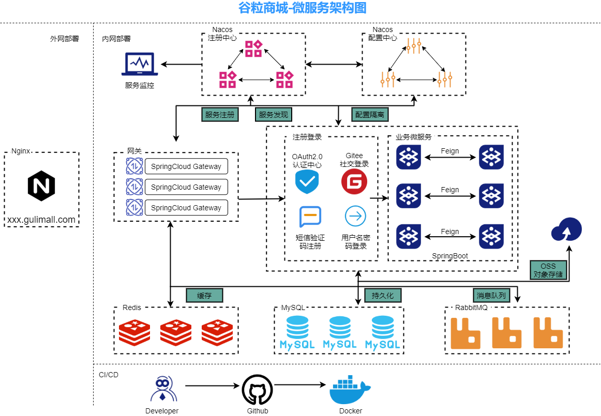
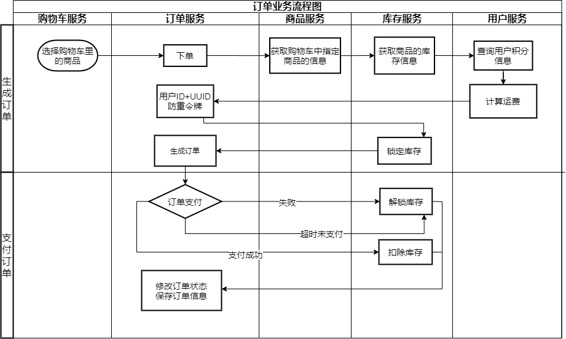
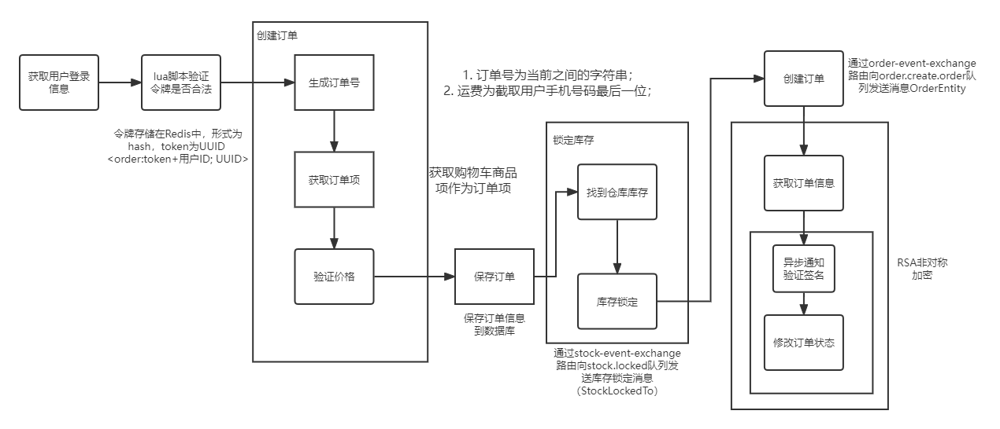

# mall

# 谷粒商城架构图




# 业务流程图

订单业务流程图




订单服务功能流程图




# 准备工作

## 1. 阿里云
在mall-third-party里的`application.yml`文件中设置阿里云OSS服务器的相关信息，格式如下：

```yaml
spring:
  cloud:
    alicloud:
      access-key: XXXXXXXXXXX
      secret-key: XXXXXXXXXXX
      oss:
        endpoint: oss-cn-shanghai.aliyuncs.com
        bucket: XXXXXXXX
      sms:
        signName: 阿里云短信测试
        templateCode: SMS_000000000
```


## 2.NATAPP内网穿透环境搭建

我使用的是免费版本的，在本地启动`natapp.exe`后得到随机的内网穿透地址，对应服务地址为`http://order.gulimall.com`，一般生成的格式为`http://xxxxx.natappfree.cc`。


## 3.支付宝开放平台

在mall-order里的`application.properties`文件中设置支付宝支付相关信息，格式如下：

```properties
#支付宝相关的配置
alipay.app_id=XXXXXXXXXXXXXXXXXXXX
#商户私钥
alipay.merchant_private_key=XXXXXXXXXXXXXXXXXXXXXXXXX
#支付宝公钥
alipay.alipay_public_key=XXXXXXXXXXXXXXXXXXXXXXXXXXX
#服务器异步通知页面路径
alipay.notify_url=http://y6fz5z.natappfree.cc/payed/notify
#页面跳转同步通知页面路径
alipay.return_url=http://member.gulimall.com/memberOrder.html
#签名方式
alipay.sign_type=RSA2
#字符编码格式
alipay.charset=utf-8
#支付宝网关地址
alipay.gatewayUrl=https://openapi.alipaydev.com/gateway.do
```


